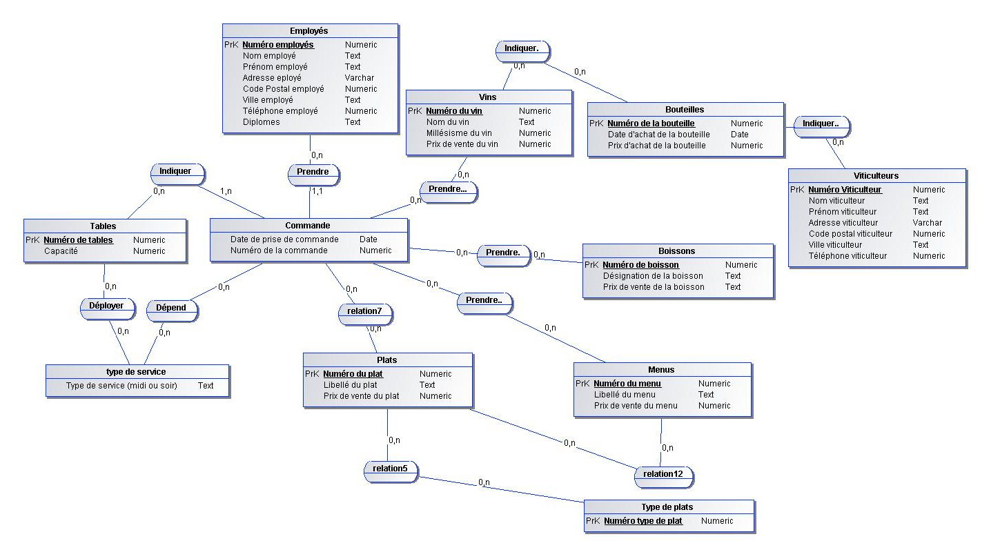
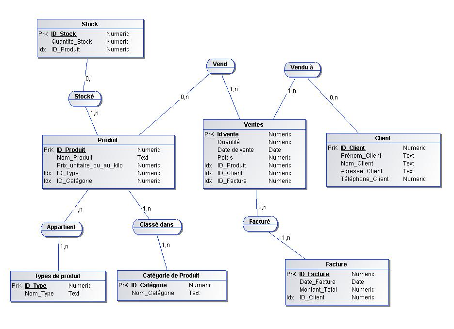
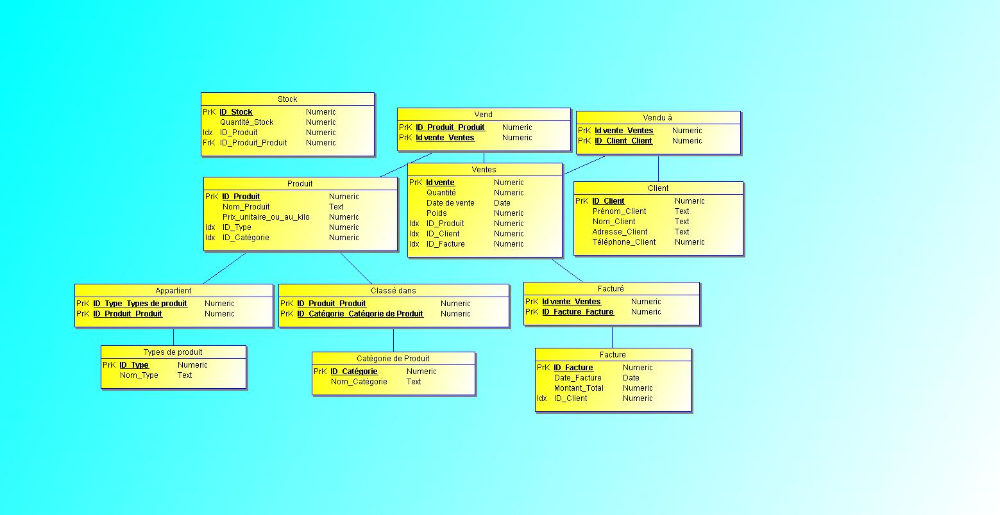
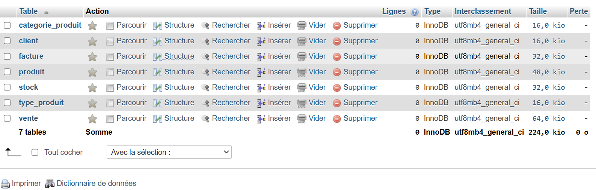
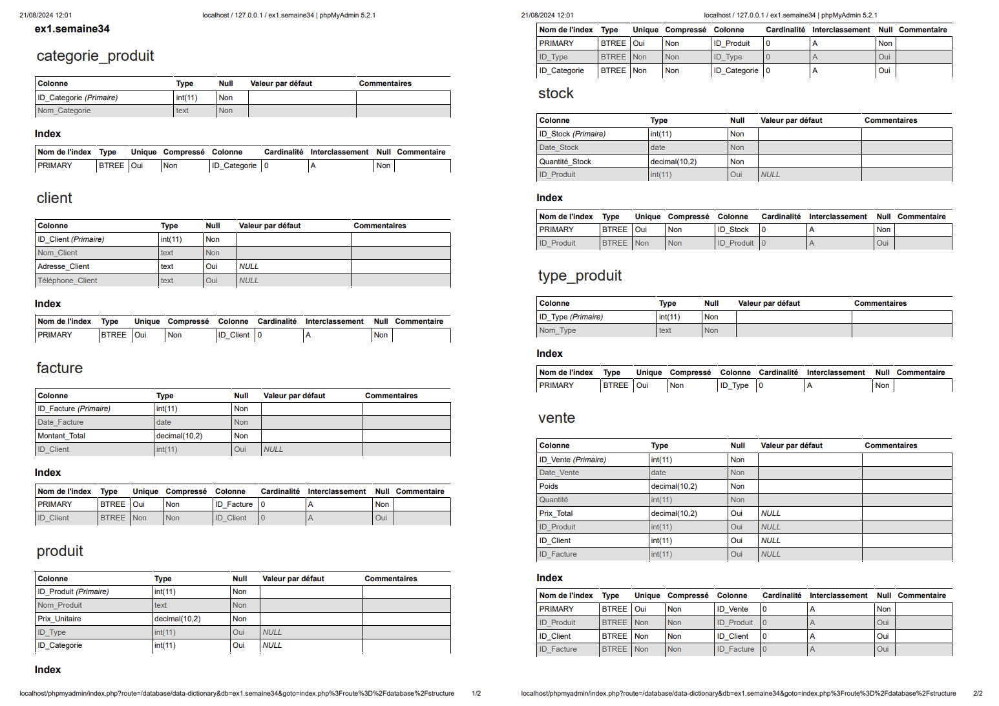

# 🧙🏾‍♂️
#  Semaine 34


# 📅 J1

  ## Intérêt de **Merise**

  Merise permet de créer un système d'information en assurant une structure rigoureuse du projet. Cela inclut la gestion des dépendances fonctionnelles, qui sont cruciales pour organiser et manipuler efficacement les données.

  #### Permet d’encadrer les projet et de se protéger contre les hors sujets. 


### Pour la creation d'un Systeme d'information, il est important de considerer 4 niveaux d'étude : 


  ## Dépendances Fonctionnelles

  Les dépendances fonctionnelles sont des relations entre les attributs d'une table. Pour travailler avec les différentes données, il est nécessaire de les trier et de les organiser en fonction de leurs types :

  - **Chaîne de caractères** : Format texte
  - **Type alphanumérique** : Format texte
  - **Type numérique**
  - **Type date**
  - **Logique booléenne** : (true, false)

  Suite à l'interview et à la collecte des documents, il est important de centraliser toutes les informations et les règles de gestion. Ce processus aboutit à la création d'un **dictionnaire de données**.


  ### Formalisation d'une Dépendance Fonctionnelle

  Pour formaliser une dépendance fonctionnelle, on utilise la notation suivante :

  `Numero adherent (Nom, prenom, code postal, ville, telephone, date d’adhesion, mail)`

  
- **Source** : Partie gauche de la notation (Numero adherent) représentant la source de la dépendance fonctionnelle.
- **But** : Partie droite représentant l'objectif de la dépendance fonctionnelle.

### Dépendances Fonctionnelles Composées

Une dépendance fonctionnelle composée intervient lorsqu'une dépendance implique plus de deux attributs comme source. Par exemple :

`(prenom eleve, date de naissance) → (note de l’eleve)`


Ici, la combinaison du prénom et de la date de naissance de l'élève permet de déterminer sa note.

### Dépendances fonctionnielles élémentaires

Une dépendance fonctionnelle A -> B est élementaire si une donnée C, sous ensemble de A qui décrit une dependance fonctionnelle type C -> B

 Exemples : 
 - `RefProduit` -> Libelle Produit 
 - `NumCommande RefProduit` -> QuantiteCommandee
 - ~~NumCommande RefProduit -> DesignationProduit~~ 


## Exercice dépendance fonctionnelle 

 **Faire un tableau de dictionnaire de donnée Merise**

Avec un énoncé et une copie de la facture 


| Nom de la donnée     | Format | Longueur | Élémentaire | Calculé | Règle de calcul     | Règle de gestion | Document |
|----------------------|--------|----------|-------------|---------|---------------------|------------------|----------|
| ID_cli               | N      |          | Oui         | Non     |                     |                  |          |
| nom_cli              | A      | 20       | Oui         | Non     |                     |                  |          |
| prenom_cli           | A      | 20       | Oui         | Non     |                     |                  |          |
| adrese_cli           | AN     | 100      | Oui         | Non     |                     |                  |          |
| cp_cli               | N      | 5        | Oui         | Non     |                     |                  |          |
| ville_cli            | AN     | 50       | Oui         | Non     |                     |                  |          |
| tel_cli              | N      | 10       | Oui         | Non     |                     |                  |          |
| date                 | Date   |          | Oui         | Non     |                     |                  |          |
| designation_pr       | AN     | 100      | Oui         | Non     |                     |                  |          |
| quantite             | N      |          | Oui         | Non     |                     |                  |          |
| prix                 | N      |          | Oui         | Non     |                     |                  |          |
| total                | N      |          | Non         | Oui     | Quantite * Prix      |                  |          |


## Partie conceptuelle **MCD**

Un `MCD` [(Modèle Conceptuel de Données)](https://www.base-de-donnees.com/mcd/) est une représentation schématique qui illustre les données d'une entreprise (ou d'un projet spécifique). Il sert à organiser, à structurer et à visualiser ces données de manière logique et facilement compréhensible.

- Les entittés sont un ensemble de propriétés qui décrivent un objet du système d'information. Elles sont représentées par un `rectangle`.


L'une de ces propriétés est `l'identifiant`. L'identifiant est une propriété qui permet d'identifier de manière unique une entité. Il est représenté par un <u>souligné</u>.


## Les relations porteuses

Une relation est dite porteuse si elle possède des propriétés. Imaginons que nous souhaitons maintenant faire apparaitre la quantité d'article commandés par un client. Nous allons donc ajouter une propriéte a la relation. 


## Les **Cardinalité**

Les `cardinalités` sont des caractères (0,1, n) qui fonctionnent par couple et qui sont présents de chaque côté d’une association (sur chaque « patte »).

Les cardinalités possibles sont :

- 0,1 : au minimum 0, au maximum 1 seule valeur (CIF) ;
- 1,1 : au minimum 1, au maximum 1 seule valeur (CIF) ;
- 0,n : au minimum 0, au maximum plusieurs valeurs ;
- 1,n : au minimum 1, au maximum plusieurs valeurs.

### Exemple 


> 3 cardinalités (2 autour de l’association « se_situe » et une dernière tronquée)

### Les relation reflexives

Une relation est dite reflexive si elle relie une entite a elle meme. 


Ici on peux voir pour la `cardinalité` que les Employés ne peuvent diriger que 1 employé. (1,1)


## Règles de concéption     

## ❗️Entité **Forte/Faible**

- Une entité est `forte` si elle peux exister toute seule et etre mere 
- L'entité enfant est défini comme une entité `faible`
Elle est considérée comme associée à une autre entitié 

<br>


## 🧑🏼‍🏭 TP conception d'un `MCD` à partir d'un dictionnaire de donnée et d'un ennoncé. 🧑🏼‍🏭 

Pour pouvoir créer un `MCD` il est necessaire de faire un interview de la sitatution et des envies du client pour son SI. Il faut prendre le plus de details en compte afin de créer un `MCD` viable et le plus proche de la realité et non pas optimiser certaines entités. 


#### Voici l'ennoncé du **TP** 


Il est nécessaire également de créer un `dictionnaire de données` qui vas grandement nous aider à la réalisation du MCD, il permet de lister tout les donnés differentes avec ces caractéristiques. 

Ici le dictionnaire de données est **donné**... 😱

- ### Dictionnaire de données du TP 📖


Voici le MCD effectué sur [JMerise](https://www.jfreesoft.com/JMerise/) qui est **gratuit** ! 



## Modèle Logique de données (MLD)

Le MLD est la suite du processus Merise, on se rapproche un peu plus de la base de données. 

### Cas simple, (0,n) (1,1) ou (1,n) (0,1)


#### Nous arrivons au MLD suivant :


L'entité qui possède la cardinalité 1,1 ou 0,1 absorbe l'identifiant de l'entite la plus forte (0,n ou 1,n). Cet identifiant devient alors une clé étrangere.
<br>

### Cas (0,n), (0,n) ou (1,n), (1,n)


Dans le cas ou la **cardinalite max** est n des deux cotes, on crée une entité intermediaire qui va contenir les deux clés étrangeres des deux entités : 


# 📅 J2

## Exercice création MCD 📋 

#### Voici l'énoncé 
_Un agriculteur, Monsieur Bousquet, fait de la vente directe de ses produits ou animaux qu’il élève. Il vend des lapins, des poules, des dindes, des veaux, des cochons. Selon la saison il vend aussi des légumes (choux, pommes de terre, carottes...) et des fruits (fraises, poires, pommes...). Il ne fait que de la vente directe. À la suite de votre discussion, il ressort les informations suivantes._

À l’heure actuelle, les ventes sont inscrites sur trois cahiers distincts :

- Un pour les animaux.

- Un pour les fruits.

- Un pour les légumes.

> Tout est vendu au kilo, les animaux sont pesés vivants avant d’être vendus.

_Il souhaiterait un logiciel simple pour saisir les ventes journalières et pouvoir éditer un récapitu-latif mensuel par type de vente (animaux, légumes et fruits) et par produit (poulets, lapins, poireaux, poires...) pour sa comptabilité._

### Travail à faire:

- Créer le Modèle Conceptuel des Données.

- Concevoir le Modèle Logique des Données.

- Finir par le Modèle Physique des Données.

## Rendu 
### Modèle conceptuel de données avec [JMerise](https://www.jfreesoft.com/JMerise/) (MCD) : 



### Voici le Modèle Logique des Données (MLD).

_Le modèle de données logique est une version plus raffinée du modèle conceptuel. Il représente de manière schématique les contraintes de données, les noms des entités et les relations à mettre en œuvre de manière indépendante à la plateforme_

[AWS AMAZON données logiques/données physique](https://aws.amazon.com/fr/compare/the-difference-between-logical-and-physical-data-model/#:~:text=Le%20mod%C3%A8le%20de%20donn%C3%A9es%20logique,mani%C3%A8re%20ind%C3%A9pendante%20%C3%A0%20la%20plateforme.)





### Et pour finir le Modèle Physique des Données (MPD)

_Dans la méthode Merise, le modèle physique des données consiste à implanter une base de données dans un SGBDR (Système de gestion de base de donnée). Le langage utilisé pour ce type d'opération est le SQL._

#### On peux voir ici la création des differentes tables, et l'assignation des clé primaire et secondaire (PRIMARY KEY, FOREIGN KEY)

  >Il est nécessaire ensuite de créer une base de donnnée et d'éxecuter cette commande dans son SGBDR, pour ma part c'est MySql. 

```sql
CREATE TABLE Type_Produit (
    ID_Type INT AUTO_INCREMENT PRIMARY KEY,
    Nom_Type TEXT NOT NULL
);

CREATE TABLE Categorie_Produit (
    ID_Categorie INT AUTO_INCREMENT PRIMARY KEY,
    Nom_Categorie TEXT NOT NULL
);

CREATE TABLE Client (
    ID_Client INT AUTO_INCREMENT PRIMARY KEY,
    Nom_Client TEXT NOT NULL,
    Adresse_Client TEXT,
    Téléphone_Client TEXT
);

CREATE TABLE Produit (
    ID_Produit INT AUTO_INCREMENT PRIMARY KEY,
    Nom_Produit TEXT NOT NULL,
    Prix_Unitaire DECIMAL(10, 2) NOT NULL,
    ID_Type INT,
    ID_Categorie INT,
    FOREIGN KEY (ID_Type) REFERENCES Type_Produit(ID_Type),
    FOREIGN KEY (ID_Categorie) REFERENCES Categorie_Produit(ID_Categorie)
);

CREATE TABLE Stock (
    ID_Stock INT AUTO_INCREMENT PRIMARY KEY,
    Date_Stock DATE NOT NULL,
    Quantité_Stock DECIMAL(10, 2) NOT NULL,
    ID_Produit INT,
    FOREIGN KEY (ID_Produit) REFERENCES Produit(ID_Produit)
);

CREATE TABLE Facture (
    ID_Facture INT AUTO_INCREMENT PRIMARY KEY,
    Date_Facture DATE NOT NULL,
    Montant_Total DECIMAL(10, 2) NOT NULL,
    ID_Client INT,
    FOREIGN KEY (ID_Client) REFERENCES Client(ID_Client)
);

CREATE TABLE Vente (
    ID_Vente INT AUTO_INCREMENT PRIMARY KEY,
    Date_Vente DATE NOT NULL,
    Poids DECIMAL(10, 2) NOT NULL,
    Quantité INT NOT NULL,
    Prix_Total DECIMAL(10, 2),
    ID_Produit INT,
    ID_Client INT,
    ID_Facture INT,
    FOREIGN KEY (ID_Produit) REFERENCES Produit(ID_Produit),
    FOREIGN KEY (ID_Client) REFERENCES Client(ID_Client),
    FOREIGN KEY (ID_Facture) REFERENCES Facture(ID_Facture)
);
```

### Voici le rendu sur Mysql 



> **Il est possible également d'exporter directement le dictionnaire de donnée ce que j'ai fait :** 




