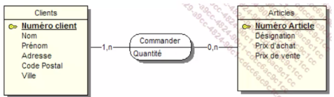
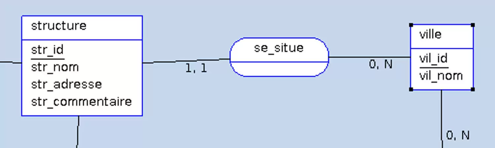

# 🧙🏾‍♂️
#  Semaine 34

  ## Intérêt de **Merise**

  Merise permet de créer un système d'information en assurant une structure rigoureuse du projet. Cela inclut la gestion des dépendances fonctionnelles, qui sont cruciales pour organiser et manipuler efficacement les données.

  #### Permet d’encadrer les projet et de se protéger contre les hors sujets. 

### Pour la creation d'un Systeme d'information, il est important de considerer 4 niveaux d'étude : 

  ## Dépendances Fonctionnelles

  Les dépendances fonctionnelles sont des relations entre les attributs d'une table. Pour travailler avec les différentes données, il est nécessaire de les trier et de les organiser en fonction de leurs types :

  - **Chaîne de caractères** : Format texte
  - **Type alphanumérique** : Format texte
  - **Type numérique**
  - **Type date**
  - **Logique booléenne** : (true, false)

  Suite à l'interview et à la collecte des documents, il est important de centraliser toutes les informations et les règles de gestion. Ce processus aboutit à la création d'un **dictionnaire de données**.

  ### Formalisation d'une Dépendance Fonctionnelle

  Pour formaliser une dépendance fonctionnelle, on utilise la notation suivante :

  `Numero adherent (Nom, prenom, code postal, ville, telephone, date d’adhesion, mail)`

  
- **Source** : Partie gauche de la notation (Numero adherent) représentant la source de la dépendance fonctionnelle.
- **But** : Partie droite représentant l'objectif de la dépendance fonctionnelle.

### Dépendances Fonctionnelles Composées

Une dépendance fonctionnelle composée intervient lorsqu'une dépendance implique plus de deux attributs comme source. Par exemple :

`(prenom eleve, date de naissance) → (note de l’eleve)`

Ici, la combinaison du prénom et de la date de naissance de l'élève permet de déterminer sa note.

### Dépendances fonctionnielles élémentaires

Une dépendance fonctionnelle A -> B est élementaire si une donnée C, sous ensemble de A qui décrit une dependance fonctionnelle type C -> B

 Exemples : 
 - `RefProduit` -> Libelle Produit 
 - `NumCommande RefProduit` -> QuantiteCommandee
 - ~~NumCommande RefProduit -> DesignationProduit~~ 

## Exercice dépendance fonctionnelle 

 **Faire un tableau de dictionnaire de donnée Merise**

Avec un énoncé et une copie de la facture 

| Nom de la donnée     | Format | Longueur | Élémentaire | Calculé | Règle de calcul     | Règle de gestion | Document |
|----------------------|--------|----------|-------------|---------|---------------------|------------------|----------|
| ID_cli               | N      |          | Oui         | Non     |                     |                  |          |
| nom_cli              | A      | 20       | Oui         | Non     |                     |                  |          |
| prenom_cli           | A      | 20       | Oui         | Non     |                     |                  |          |
| adrese_cli           | AN     | 100      | Oui         | Non     |                     |                  |          |
| cp_cli               | N      | 5        | Oui         | Non     |                     |                  |          |
| ville_cli            | AN     | 50       | Oui         | Non     |                     |                  |          |
| tel_cli              | N      | 10       | Oui         | Non     |                     |                  |          |
| date                 | Date   |          | Oui         | Non     |                     |                  |          |
| designation_pr       | AN     | 100      | Oui         | Non     |                     |                  |          |
| quantite             | N      |          | Oui         | Non     |                     |                  |          |
| prix                 | N      |          | Oui         | Non     |                     |                  |          |
| total                | N      |          | Non         | Oui     | Quantite * Prix      |                  |          |

## Partie conceptuelle **MCD**

Un `MCD` [(Modèle Conceptuel de Données)](https://www.base-de-donnees.com/mcd/) est une représentation schématique qui illustre les données d'une entreprise (ou d'un projet spécifique). Il sert à organiser, à structurer et à visualiser ces données de manière logique et facilement compréhensible.

- Les entittés sont un ensemble de propriétés qui décrivent un objet du système d'information. Elles sont représentées par un `rectangle`.

L'une de ces propriétés est `l'identifiant`. L'identifiant est une propriété qui permet d'identifier de manière unique une entité. Il est représenté par un <u>souligné</u>.

## Les relations porteuses

Une relation est dite porteuse si elle possède des propriétés. Imaginons que nous souhaitons maintenant faire apparaitre la quantité d'article commandés par un client. Nous allons donc ajouter une propriéte a la relation. 

## Les **Cardinalité**

Les `cardinalités` sont des caractères (0,1, n) qui fonctionnent par couple et qui sont présents de chaque côté d’une association (sur chaque « patte »).

Les cardinalités possibles sont :

- 0,1 : au minimum 0, au maximum 1 seule valeur (CIF) ;
- 1,1 : au minimum 1, au maximum 1 seule valeur (CIF) ;
- 0,n : au minimum 0, au maximum plusieurs valeurs ;
- 1,n : au minimum 1, au maximum plusieurs valeurs.

### Exemple 

> 3 cardinalités (2 autour de l’association « se_situe » et une dernière tronquée)

### Les relation reflexives

Une relation est dite reflexive si elle relie une entite a elle meme. 

Ici on peux voir pour la `cardinalité` que les Employés ne peuvent diriger que 1 employé. (1,1)

## Règles de concéption     

## ❗️Entité **Forte/Faible**

- Une entité est `forte` si elle peux exister toute seule et etre mere 
- L'entité enfant est défini comme une entité `faible`
Elle est considérée comme associée à une autre entitié 

# le nom d'une propriété est retourvé qu'une seule fois dans le mcd